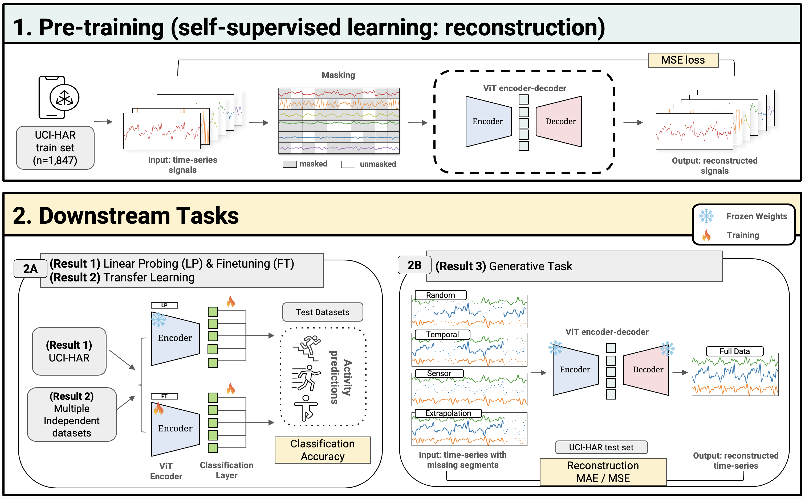

# MoCA: Multi-modal Cross-masked Autoencoder for Time-Series in Digital Health
- [Demonstration](#Demonstration)
- [Setting up Environment](#Setting-up-Environment)
- [Data and Checkpoints](#Data-and-Checkpoints)
- [Pre-training](#Pre-training)
- [Downstream Classification Tasks](#Downstream-Classification-Tasks)




## Demonstration
For reconstruction and classification demonstration on the UCI-HAR dataset, go to [UCIHAR_mae_visualize.ipynb](https://github.com/HowonRyu/MoCA/blob/main/UCIHAR_mae_visualize.ipynb).


  
## Setting up Environment
This repository uses [Git Large File Storage (LFS)](https://git-lfs.github.com/) for checkpoints. Before cloning the repository, run 
```
git lfs install
```
to install LFS.

To get started, clone the repository to your local or cluster machine by running the following commands in your terminal
```
git clone https://github.com/HowonRyu/MoCA.git
cd MoCA
```
You can set up the environment by installing the required dependencies:
```
pip install -r requirements.txt
```
The list of dependencies can be found in the [requirements.txt](https://github.com/HowonRyu/MoCA/blob/main/requirements.txt) file.

## Data and Checkpoints
- MoCA defaults to using the pre-processed UCI-HAR[[1]](#1) dataset located in [MoCA/data/{data_length}](https://github.com/HowonRyu/MoCA/tree/main/data). Default input length is 200 in MoCA.
- The pre-trained checkpoints can be found in [MoCA/checkpoints](https://github.com/HowonRyu/MoCA/tree/main/checkpoints).


## Pre-training
You can pre-train from scratch by using `submitit_pretrain.py`, which calls the `main_pretrain.py` script, using the following:


```
python {path_to_submitit.pretrain.py} \
	--wk_dir {path_to_working_directory}  --job_name {job_nickname} \
	--data_path {path_to_data} \
	--nodes 1  --use_volta32 x \
	--batch_size 50 --num_workers 4 \
	--model mae_vit_base_patch16 --mask_ratio 0.25 --patch_size1 1 --patch_num 10 --alt \
	--epochs {epochs} --warmup_epochs {warm_up_epochs} --dump_freq {checkpoint_save_frequency(epochs)} \
	--lr 0.0005 --weight_decay 0.05 --loss_type 'all' --device 'cuda'
```


## Downstream Classification Tasks
Given a pre-training checkpoint (weights), you can finetune/linear probe using the following scripts:

- Finetuning
```
python {path_to_submitit_finetune.py} \
    --wk_dir  {path_to_working_directory} --job_name {job_nickname} \
    --data_path {path_to_working_directory} \
    --nodes 1 --batch_size 5 --epochs {epochs}  \
    --cls_token --nb_classes 7 --patch_num 10 --patch_size1 1 --alt \
    --model vit_base_patch16  \
    --lr 0.001 --weight_decay 0 --device 'cuda' --dump_freq 50 \
    --finetune {path_to_pretrained_checkpoints} 
```

- Linear Probing
```
python {path_to_submitit_linprobe.py} \
    --wk_dir  {path_to_working_directory} --job_name {job_nickname} \
    --data_path {path_to_working_directory} \
    --nodes 1 --batch_size 5 --epochs {epochs}  \
    --cls_token --nb_classes 7 --patch_num 10 --patch_size1 1 --alt \
    --model vit_base_patch16  \
    --lr 0.001 --weight_decay 0 --device 'cuda' --dump_freq 50 \
    --finetune {path_to_pretrained_checkpoints} 
```


## Reference
<a id="1">[1]</a> Reyes-Ortiz, J., Anguita, D., Ghio, A., Oneto, L., & Parra, X. (2013). Human Activity Recognition Using Smartphones [Dataset]. UCI Machine Learning Repository. https://doi.org/10.24432/C54S4K.

